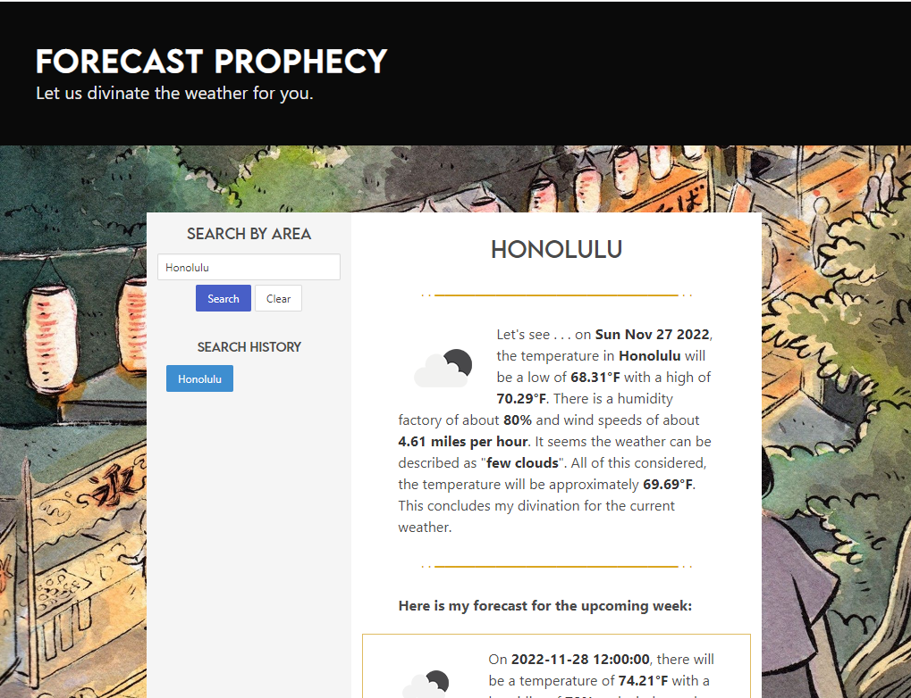

# **area-forecast**

## Description

This repository utilizes the Third Party Web API, **Open Weather Map**, to create a six-day forecast for the viewer.

· · ────────────────── · ·

## Table of Contents
- [**area-forecast**](#area-forecast)
  - [Description](#description)
  - [Table of Contents](#table-of-contents)
  - [Features](#features)
  - [Roadmap](#roadmap)
  - [Installation](#installation)
  - [Questions](#questions)
  - [Credits](#credits)

## Features

The deployed application and repository contains the following features:

- Semantic HTML structuring for accessibility.
- Guided comments along CSS and JavaScript files to navigate structure.
- Thirty-Party CSS Frameworks including: Bulma
- Media query and flexboxes for various resolutions and devices.
- Third-Party API Open Weather Map to publish data around weather.

The website can be accessed at the following deployed link: https://christiangella.github.io/area-forecast/

## Roadmap

The application could be improved by integrating the following:

- **Search History**: The repository currently does not save search histories to local storage.

## Installation

Copy the HTTPS or SSH key into your terminal and perform a git pull to create a local copy of the repository.

A copy of this repository can be cloned using either of the following codes:

- HTTPS: https://github.com/christiangella/area-forecast.git
- SSH: git@github.com:christiangella/area-forecast.git

## Questions

This repository was created by Manong Chris. For further support, reach out by email at christian.gella@gmail.com or by Github at christiangella.

## Credits

This repository was developed for the UC Davis Fullstacks Bootcamp under the UC Davis Continuing and Professional Education. The background of this repository was created by Heikala.

· · ────────────────── · ·

